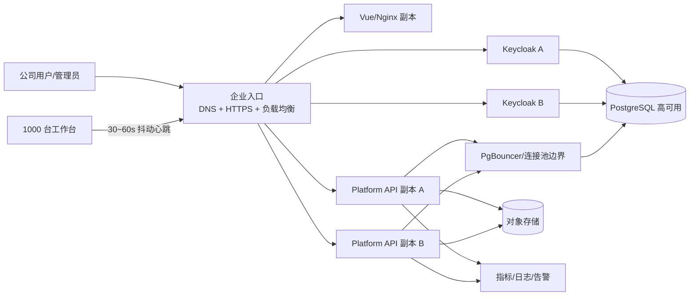

# 管理平台 V0.1 公司级容量与扩展性评估

**日期**：2026-08-16
**评估目标**：1000 人同时在线，并监控对应工作台
**结论**：架构方向可以演进到目标容量，但当前 V0.1 原样部署不能承诺支撑该目标。

## 1. 结论边界

“1000 人同时在线”需要区分不同负载：

| 场景 | 当前判断 |
|---|---|
| 1000 个已建立、大部分空闲的 BFF 会话 | 数据模型可容纳，但尚无容量测试 |
| 1000 人同时加载页面或集中登录 | 当前不能保证 |
| 1000 台工作台定时上报在线状态 | 平台协议已具备，但客户端无自动心跳，服务端未压测 |
| 管理员准实时查看 1000 台工作台在线/离线 | 当前只有一次性列表和最后心跳，无实时更新通道 |
| 监控数字员工任务、日志、资源、成本 | V0.1 尚未实现对应数据模型和通信通道 |

1000 人规模不需要立即把平台拆成微服务。保留模块化单体，先完成多副本、数据库并发、分页、自动心跳、IAM 生产集群、共享存储和可观测性改造，是风险更低的路径。

## 2. 可保留的扩展基础

- 前端、API、Keycloak、PostgreSQL 和工作台已是独立部署单元。
- 人员身份由 Keycloak 管理，业务授权在平台内以固定角色和 SQL 数据范围执行。
- BFF 会话保存在 PostgreSQL，不依赖单个 API 进程内存，可以演进为多 API 副本。
- 工作台人员身份与机器身份分离，具备持钥证明、短期 Token、心跳和撤销机制。
- 关键状态使用 PostgreSQL 事务和唯一约束，能在多副本时继续作为一致性边界。

## 3. 当前容量与高可用缺口

### 3.1 API 单进程

当前启动命令只有一个 Uvicorn worker：[platform/backend/entrypoint.sh](../../platform/backend/entrypoint.sh#L9)。集中登录、列表查询、Token 签发或心跳会共享该进程，同时它也是故障单点。

Uvicorn 官方部署指南建议生产环境使用多 worker/进程管理和前置代理：[Uvicorn Deployment](https://uvicorn.dev/deployment/)。

### 3.2 `async` 接口中使用同步数据库 Session

当前 `create_engine()` 和 `Session` 均为同步实现，并被大部分 `async` 路由直接调用：[platform/backend/app/database.py](../../platform/backend/app/database.py#L26)。数据库 I/O 会占用事件循环，并发请求增加时延迟会累积。

连接池也没有显式容量参数。SQLAlchemy QueuePool 常见默认是 `pool_size=5`、`max_overflow=10`；扩展多个 worker 后，必须按数据库总连接上限统一分配：[SQLAlchemy QueuePool](https://docs.sqlalchemy.org/en/21/errors.html)。

### 3.3 Keycloak 开发模式单实例

Compose 使用 `start-dev`：[tools/compose.yml](../../tools/compose.yml#L16)。Keycloak 开发模式使用本地缓存且安全默认不适合生产。官方生产指南建议使用生产模式、TLS、生产数据库，并在需要高可用时部署两个或更多实例：[Keycloak Configuration](https://www.keycloak.org/server/configuration)、[Production Configuration](https://www.keycloak.org/server/configuration-production)。

### 3.4 列表无分页

工作台列表会查询并返回当前权限范围的全部数据：[platform/backend/app/api/enrollment.py](../../platform/backend/app/api/enrollment.py#L540)。1000 行对数据库未必是大负载，但一次传输和浏览器 DOM 渲染会降低管理页响应性。接入申请和安装包管理也需要统一分页契约。

### 3.5 没有持续监控通道

工作台只在“继续接入”或人工调用心跳接口时上报：[workbench/src/server.ts](../../workbench/src/server.ts#L131)。当前没有：

- 后台定时心跳；
- 随机抖动、超时、指数退避和断网恢复；
- 在线汇总接口；
- 管理界面轮询、SSE 或 WebSocket 实时更新；
- 数字员工任务和运行遥测数据。

当前每次心跳前都重新申请机器 Token，没有复用已获得且未过期的 Token。若 1000 台工作台每 30 秒上报，则稳态约为：

```text
心跳：1000 / 30 ≈ 33 请求/秒
Token：1000 / 30 ≈ 33 请求/秒
合计：约 67 请求/秒，并产生持续数据库写入
```

机器 Token 最长有效 5 分钟，应缓存到接近过期时再更新，并定期清理已过期 `used_jti`。

### 3.6 多副本运行时配置不一致

平台设置在写入数据库后，还会修改当前 API 进程的内存 Settings：[platform/backend/app/api/core.py](../../platform/backend/app/api/core.py#L165)。扩展多 worker/副本后，其他进程不会自动获得更新，需改为以数据库为唯一事实源，或引入带版本的缓存失效机制。

### 3.7 本地文件存储与内存上下载

安装包使用本地 Docker volume，且上传和下载都会把完整文件读入内存：[platform/backend/app/api/packages.py](../../platform/backend/app/api/packages.py#L49)。这会阻碍 API 水平扩展，并放大并发下载的内存消耗。

### 3.8 单机数据库和可观测性不足

当前 PostgreSQL 是单容器、单数据卷，没有高可用、备份恢复演练、连接池代理和慢查询监控。平台也没有 Prometheus 指标、集中日志、告警和分布式追踪后端。

## 4. 1000 人目标的最小生产架构



本阶段不需要为 1000 人引入 Kafka 或拆分微服务。在线总览可以先使用服务端聚合接口和 5~10 秒管理端轮询；只有当后续出现大量运行事件、长时间遥测或更高设备规模时，再评估事件总线和时序存储。

## 5. 必须完成的生产化改造

### P0：上线前必须完成

- 落地稳定 DNS、HTTPS 反向代理、Secure Cookie 和部署 Secret。
- Keycloak 切换生产模式，至少两副本，增加 readiness 和故障切换验证。
- Platform API 至少两副本；数据库访问统一为正确的异步模式，或完整放入同步工作线程，不再阻塞 ASGI 事件循环。
- 显式配置每个 API/Keycloak 副本的数据库连接预算，必要时使用 PgBouncer。
- PostgreSQL 转为公司标准的高可用实例，配置备份、恢复演练和慢查询观测。
- 所有管理列表使用稳定分页，工作台列表增加状态、部门和版本筛选。
- 工作台增加 30~60 秒自动心跳、随机抖动、超时、指数退避和断网恢复；复用未过期机器 Token。
- 平台设置以数据库为唯一事实源，保证多副本一致。
- 安装包迁移到共享对象存储，上下载改为流式处理。
- Alembic 迁移从每个 API 副本的启动流程中拆分为独立部署任务。
- 增加 Prometheus 指标、集中日志、告警和数据库/Keycloak 监控。

### P1：容量和运维增强

- 提供工作台在线/离线聚合接口，避免管理界面每次读取全量明细。
- 定期清理过期 BFF Session、challenge 和 `used_jti`。
- 为心跳、工作台状态、审计时间范围增加压测后确认的索引。
- 根据真实流量调整 API worker、连接池、Keycloak JVM 和 PostgreSQL 参数，不在未压测前写死生产数值。

## 6. 容量验收基线

以下是面向 1000 人的建议验收基线，需在类生产环境使用真实 Keycloak、PostgreSQL 和 API 执行，禁止用 mock 代替关键链路：

- 1000 个已建立人员会话。
- 1000 台工作台每 30 秒带随机抖动心跳，持续 60 分钟。
- 100~200 RPS 混合管理 API 负载，持续 30 分钟。
- 100 个并发 OIDC 登录突发。
- 读取 API P95 小于 500 ms，心跳 P95 小于 300 ms。
- 总错误率小于 0.1%，且无数据范围越权、重放或重复实例。
- 停止任一 Platform API 或 Keycloak 副本时，已建立的平台服务不整体中断。
- 压测期间持续观测 CPU、内存、数据库连接、锁等待、慢查询、Keycloak 登录延迟和 API 错误码。

在该基线完成前，不宣称系统已支撑 1000 人同时在线。

## 7. 非目标

- 本文不宣布当前 V0.1 已经达到公司级生产容量。
- 本文不要求为 1000 人立即拆分微服务或引入消息队列。
- 本文不替代硬件规格、数据增长量、可用性等级和灾备目标的后续选型。
