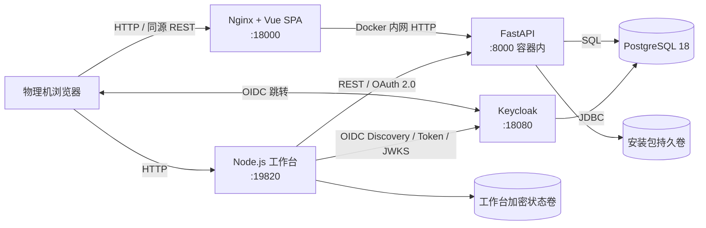

# 管理平台 V0.1 当前实现架构

**状态**：已实现，以当前代码为准
**范围**：管理平台 V0.1、Keycloak IAM、最小工作台认证 Demo

## 1. 总体架构

V0.1 是单机 Docker Compose 部署的模块化单体。管理平台的前后端分离，但对浏览器使用同一个 origin；Keycloak 独立负责人员身份；工作台是独立 Node.js 进程，仅实现登录和可信接入演示。

Compose 共启动五个服务：`postgres`、`keycloak`、`platform-api`、`platform-web`、`workbench`。PostgreSQL 不暴露宿主机端口。

## 2. 管理前端

- 技术栈：Vue 3、TypeScript、Vite、Pinia、Vue Router。
- 交付形态：Vite 生成静态文件，Nginx 提供 SPA 和反向代理。
- 页面：公开下载首页、总览、工作台、接入申请、审计、安装包、权限配置、平台设置。
- 数据访问：前端只请求同源 `/api/*` 和 `/auth/*`，Nginx 转发到 `platform-api:8000`。
- 会话：浏览器仅保存 HttpOnly `platform_session` Cookie，不保存 Keycloak Token。
- 路由权限：前端根据 `/api/v1/me` 返回的 permission 隐藏菜单和操作；这只是交互层控制，最终授权仍由后端执行。
- 日志：Nginx 对 `/auth/callback` 精确路径禁用 access log，避免记录 OIDC Authorization Code。

## 3. 管理后端

- 技术栈：Python 3.11、FastAPI、SQLAlchemy 2、Alembic、Pydantic、Authlib/PyJWT。
- 结构：单个 FastAPI 进程，按认证、权限、安装包、接入、机器认证、审计和设置分模块；模块之间是本地函数和数据库事务，不是网络微服务。
- 接口形态：REST + JSON；文件上传使用 `multipart/form-data`，下载使用流式响应，机器 Token 端点使用 `application/x-www-form-urlencoded`。
- 事务：关键状态变更由 PostgreSQL 事务和唯一约束保障，包括重复申请、challenge 消费、实例创建、JTI 防重放和最后系统管理员保护。
- 可观测性：每个请求使用 `X-Trace-Id`，重要操作写入脱敏审计表。Uvicorn 访问日志已关闭。

### 3.1 授权模型

后端内置六个固定角色：`SYSTEM_ADMIN`、`PLATFORM_ADMIN`、`DEPARTMENT_ADMIN`、`SECURITY_ADMIN`、`AUDIT_ADMIN`、`EMPLOYEE`。数据范围为 `GLOBAL`、`ALL_DEPARTMENTS`、`DEPARTMENT_SET`、`SELF`。

请求处理时先校验功能 permission，再把数据范围转换为 SQL 查询条件；详情和变更操作会再次校验目标资源。

## 4. 身份与认证

### 4.1 管理平台人员登录

1. 浏览器请求 `/auth/login`。
2. FastAPI 生成 state、nonce 和 PKCE verifier，通过签名 HttpOnly Cookie 保存临时流程。
3. 浏览器跳转 Keycloak 完成 Authorization Code 登录。
4. FastAPI 在后端交换 code，校验 issuer、audience、签名、state 和 nonce。
5. 平台以 `(issuer, sub)` 映射人员，在 PostgreSQL 中建立 8 小时 BFF 会话，浏览器获得 opaque Cookie。

### 4.2 工作台人员登录与机器身份

1. 工作台作为 Public Client，使用 Authorization Code + PKCE S256 登录 Keycloak，无 Client Secret。
2. 人员 access token 和会话仅保存在工作台进程内存，进程重启后失效。
3. 工作台首次运行生成 P-256/ES256 密钥对，私钥随本地状态用 AES-256-GCM 加密后以 `0600` 权限持久化。
4. 管理员批准申请后，工作台使用 ES256 proof JWT 回应一次性 challenge，平台只保存公钥。
5. 工作台用 ES256 `private_key_jwt` 换取最长 5 分钟的 HS256 Bearer 机器 Token，仅含 `workbench.heartbeat` scope。
6. 每次心跳都检查 Token 与当前实例/凭证状态，撤销后旧 Token 也不能继续心跳。

## 5. 数据与存储

| 类别 | 位置 | 内容 |
|---|---|---|
| IAM 数据 | Keycloak 使用的 PostgreSQL database | Realm、Client、用户、组织属性和密码 |
| 平台业务数据 | `platform` PostgreSQL database | IAM 快照、角色授权、接入、工作台、审计、设置和 BFF 会话 |
| 安装包 | `package-data` Docker volume | 实际文件；元数据和 SHA-256 在平台数据库 |
| 工作台状态 | `workbench-data` Docker volume | installation ID、加密私钥、接入 ID、实例 ID 和最后心跳 |
| 短期工作台会话 | Node.js 进程内存 | OIDC 流程、人员 Token、会话和机器 Token |

Alembic 在 `platform-api` 启动时自动执行。平台和 Keycloak 使用同一 PostgreSQL 容器中的两个独立 database。

## 6. 数据通信通道

| 起点 → 终点 | 通道 | 数据/用途 | 认证 |
|---|---|---|---|
| 浏览器 → Nginx | HTTP（V0.1 私网） | SPA、JSON API、文件上下载 | BFF Cookie；公开包下载匿名 |
| Nginx → FastAPI | Docker 内网 HTTP | `/api/*`、`/auth/*`、`/health/*` | 原样传递 Cookie/请求头 |
| 浏览器 ↔ Keycloak | OIDC Authorization Code + PKCE | 人员登录、授权回调 | Keycloak 账号密码 |
| FastAPI → Keycloak | Docker 内网 HTTP | Discovery、Token 交换、JWKS | OIDC Client |
| FastAPI → PostgreSQL | TCP/SQLAlchemy | 业务事务与会话 | 数据库账号 |
| Keycloak → PostgreSQL | TCP/JDBC | IAM 持久化 | 独立数据库账号 |
| 浏览器 → 工作台 | HTTP（V0.1 私网） | 登录、申请、继续接入、心跳 | HttpOnly 工作台会话 Cookie |
| 工作台 → FastAPI | Docker 内网 HTTP REST | 配置发现、接入、challenge/proof、Token、心跳 | 人员 Bearer Token 或机器 Bearer Token |
| 工作台 → Keycloak | Docker 内网 HTTP | Discovery、code 交换、JWKS | PKCE Public Client |
| 启动工具 → Keycloak | Admin REST / `kcadm` | 幂等同步 Redirect URI 和 Web Origin | Keycloak 管理员 |

当前没有消息队列、WebSocket、SSE、gRPC 或后台事件总线。工作台心跳是由工作台 Demo 触发的同步 HTTP 请求，在线状态由平台服务器时间和最后心跳推导。

## 7. 公开地址与部署边界

`PUBLIC_HOST` 是 V0.1 唯一公开主机配置源，派生管理平台 `:18000`、Keycloak `:18080`、工作台 `:19820`、OIDC issuer 和回调地址。容器内服务间访问使用 Compose DNS，不绕经宿主机公开端口。

V0.1 的非回环 HTTP 仅适用于受控私网验收。生产环境需迁移到稳定 DNS、HTTPS 反向代理、Secure Cookie 和部署 Secret，见 [管理平台 V0.1 部署与外部访问设计](管理平台V0.1部署与外部访问设计.md)。

## 8. 当前边界

- 工作台只是最小认证/接入 Demo，不含数字员工、编排、记忆或多底座适配。
- 平台是单例模块化单体，没有高可用、水平扩展或分布式事务。
- 默认账号和开发 Secret 只用于 V0.1 验收，不能原样用于生产。
- 当前心跳由 Demo 按钮/接入流程触发，没有后台定时循环。
